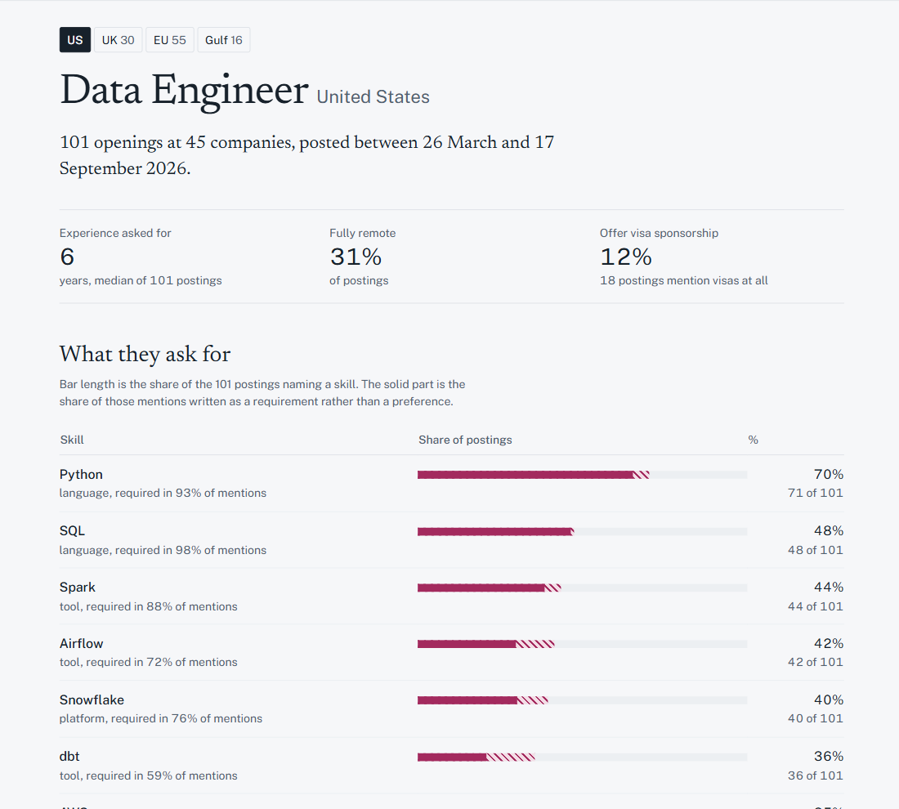

# Job Insight

**What do companies in a given region actually want from a given role?**

Job adverts are the only public record of what employers ask for, and they are unreadable
in bulk. Job Insight collects them from public sources, reads each one with a language
model, and turns the result into percentages you can check:

> Of 101 Data Engineer openings posted in the United States, **70% asked for Python**, 44%
> for Spark, 42% for Airflow, and 36% for dbt. Half wanted six years or more. 31% were
> fully remote.

Seven roles across four regions, every figure published with the sample size behind it.



- **Roles:** Data Engineer, Analytics Engineer, Data Analyst, AI Engineer, ML Engineer, MLOps Engineer, Data Scientist
- **Regions:** US, UK, EU, Gulf
- **Answers:** which skills, how often, required or merely preferred, how it changes with
  seniority and region, what the job pays, whether visas are sponsored

## How it works

```text
  Greenhouse ─┐
  Lever       │
  Ashby       ├─► ingest ──► raw.postings ──► extract ──► raw.extractions
  SmartRecr.  │   (dedupe,   (full text,      (Gemma 4,   (JSON per posting)
  Workday     │    normalise) text_quality)    quota-paced)      │
  Adzuna      │                                                  ▼
  JSearch    ─┘                                    dbt: staging → intermediate → marts
                                                              │
       Airflow schedules all three, daily                     ▼
       03:00 ingest · 06:00 extract · 08:00 dbt      Neon Postgres ──► Next.js on Vercel
```

**Ingestion.** One client per source, each returning the same `RawPosting`, upserted on
`(source, source_id)` so re-running changes nothing. Five applicant tracking systems are
read per company from a curated list of 185 boards; Adzuna and JSearch are queried by role
and country to fill gaps. Postings are kept only when the title plausibly matches a curated
role and the free-text location resolves to a curated country — "Remote" alone is discarded
rather than guessed at. Duplicates are linked, not deleted, and only the canonical copy
counts.

**Extraction.** Each full-text posting goes to Gemma 4 through the Gemini API, which
returns structured JSON: skills with `required` / `preferred` / `unclear`, seniority, years
of experience, work mode, visa sponsorship. Pydantic validates at the boundary; the raw
JSON is stored, so changing the skill taxonomy never means paying to re-read a posting.
Extracted names are mapped onto canonical skills, so "Postgres", "PostgreSQL" and "psql"
are one row rather than three.

**Modelling.** dbt turns the JSON into marts — staging, intermediate, then one table per
question. Every mart row carries its sample size, and data tests fail the build if a
percentage escapes 0–1, a count exceeds its cohort, or a salary band is not annual.

**Dashboard.** Next.js server components query the marts directly. There is no API layer,
because nothing outside the pages consumes the data. Pages are cached for an hour, since
the marts change once a day.

## Data quality is the point

This is a statistics project as much as a pipeline. The rules it holds itself to:

- **A percentage never mixes text qualities.** Adzuna returns 500-character excerpts that
  are usually an "About us" blurb naming no skills. Anything context-dependent — required
  vs. preferred, seniority, sponsorship — is computed only over full descriptions.
- **Every published figure shows its denominator.** Cohorts under 25 postings are marked
  low-confidence and greyed, not silently dropped, so thin evidence is visible rather than
  absent.
- **Nothing estimated is republished as fact.** Adzuna predicts salaries for postings that
  do not state one; those are excluded. About one stated salary in nine is an unlabelled
  hourly or monthly rate, so figures outside a plausible annual band are dropped rather
  than guessed at.
- **Accuracy is measured, not assumed.** Extraction is scored against hand-labelled
  postings: 100% on years of experience, visa sponsorship and work mode, 95% on seniority,
  84% on role, and 81% precision / 80% recall on skills. The labelled set is small and the
  README says so on the [methodology page](docs/methodology.md), which is published on the
  site rather than buried in the repo.

[docs/lessons.md](docs/lessons.md) records every mistake that cost real time and the rule
it produced — a rate limiter that limited the wrong quantity, a fix that made a problem
invisible, a lookup table that was not itself deduplicated.

## Engineering notes

Problems that shaped the design, and what was done about them:

| Problem | Resolution |
| --- | --- |
| Extraction hit 429s on 18% of calls while pacing safely under the documented 30 requests/minute | The binding quota was **16,000 input tokens per minute**, not requests. Replaced the request pacer with a rolling-window token budget calibrated on 800 real prompts. Throughput 7.0 → 8.7 postings/min, refusals 18% → 5.4% |
| HTTP retries bypassed the rate limiter, so each refusal triggered six more unpaced requests | Removed 429 from retryable statuses; the run now pauses every worker for the delay the server states |
| Rate-limited postings were stored as errors, spending their retry budget on a bad minute | Transient failures are no longer written at all; the posting stays pending and its reserved quota is returned |
| ATS coverage skewed to tech companies, leaving UK and Gulf thin | Added SmartRecruiters and Workday clients, reaching pharma, banking and industrial employers. Corpus +72%; the Gulf published its first cohort |
| Workday's country facet is named differently by every tenant, and 9 of 11 boards returned zero | Reframed filtering as an optimisation rather than a requirement — every posting states its own country, so a board with no usable facet is listed in full |
| `mart_salary` published a 25th percentile of 55 EUR | Hourly and monthly rates are unlabelled in the source. Restricted to an annual band, three currencies, stated figures only, with a dbt test |
| Two skills were stored under two canonical spellings each, halving their apparent demand | Every validity test passed, because two half-sized rows are individually valid. Added a test that compares canonical names to each other with case and punctuation stripped |

Verification is part of each phase rather than follow-up work: **213 Python tests**, **14
Playwright smoke tests** asserting the site's own rules against the rendered page, and **25
dbt models and data tests**. CI runs lint, typecheck and the suites on every push.

The most recent of those caught a credential leak that was not in this project's code: a
test asserting the alert webhook URL never reaches the logs failed on `httpx`, which logs
every request at INFO with the full URL. Airflow captures task logs, so each alert would
have written a working credential onto the server — unattended, at the moment something
else was already wrong.

## Where it stands

Phases 1–5 of 6 are complete; phase 6 is written and tested, and waiting on the accounts it
deploys to. The pipeline runs unattended on a daily schedule — ingest at 03:00, extraction
at 06:00, `dbt build` at 08:00 — and the dashboard reads the marts it produces.

| | |
| --- | --- |
| Postings collected | 6,479 from 7 sources |
| Unique full-text postings analysed | 2,822 |
| Behind the published figures (180-day window) | 1,722 postings, 270 companies |
| Company job boards tracked | 185 across 5 ATS platforms |
| Canonical skills | 412 |
| Publishable cohorts | 18 of 28 role-and-region pairs |
| Pages prerendered | 169 |
| Running cost | $0 — every service is a free tier |

Deployment is an Oracle Cloud Always Free ARM VM for the pipeline, Vercel for the
dashboard, Neon for the data — with a built Airflow image, an Airflow UI that is never
exposed to the internet, and one webhook alert per failed run.
[docs/deploy.md](docs/deploy.md) is the runbook.

Code changes deploy on push; **data changes need no deploy at all**, because the pages are
prerendered with hourly revalidation and pick up each morning's marts on their own. That is
why the dashboard is cached server components rather than a static export.

Still to come: the trend view, which needs several more weeks of collection before a line
would mean anything.

## Running it

```bash
cp infra/.env.example .env          # Neon, Gemini, Adzuna and JSearch credentials
python -m pip install -e ".[dev]"
python -m pipeline.db.migrate       # idempotent
docker compose -f infra/docker-compose.yml up -d     # Airflow at localhost:8080

python -m pipeline.db.dbt_profile   # writes profiles.yml from DATABASE_URL
dbt build --project-dir pipeline/dbt --profiles-dir pipeline/dbt

cd web && npm install && npm run dev                 # dashboard at localhost:3000
```

Checks:

```bash
pytest pipeline/tests                       # 213 tests
ruff check pipeline && black --check pipeline
python -m pipeline.eval.run_eval            # extraction accuracy on the golden set
cd web && npm run lint && npm run typecheck && npm run test:e2e
```

## Layout

```text
pipeline/
  dags/        Airflow DAGs: ingest, extract, transform
  ingest/      one client per source, plus normalisation and dedupe
  extract/     LLM backends, extraction schema, quota governor
  taxonomy/    roles, regions, companies, skill aliases
  eval/        golden set and evaluation harness
  dbt/         staging → intermediate → marts
  tests/       pytest suite
web/           Next.js dashboard, e2e/ smoke tests
infra/         docker-compose, SQL schema, .env.example
docs/          design, methodology, deployment runbook, progress log, lessons
```

[docs/design.md](docs/design.md) has the full design and
[docs/PROGRESS.md](docs/PROGRESS.md) the running log of what was built and verified.
